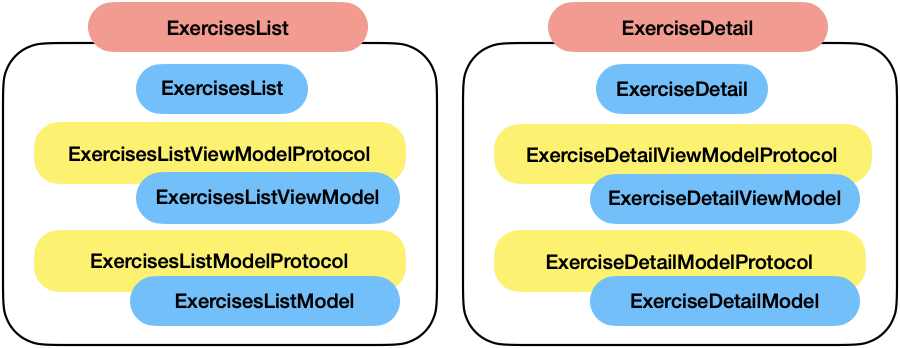
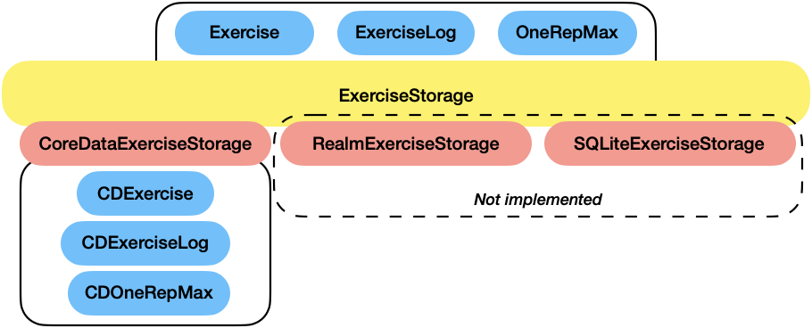
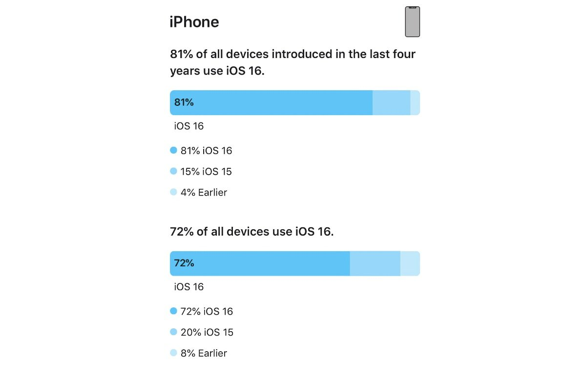
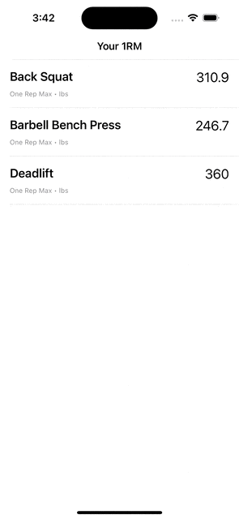

# One-Rep Max app

The goal of this app is to import historical workout data and calculate the theoretical one-rep max for each exercise.

It will also provide a handy way of checking the evolution of those one-rep max values over time.

## Usage

The app implements file handling for plain text files, so importing data will be as easy as opening a text file (with the right format) with the app.

When using the simulator, draggin' and droppin' the file to it will have that same effect.

For simplicity, and given that it wasn't specified differently in the requirements, importing the contents of a new file will automatically delete all the previously existing data.

## Architecture

Even though SwiftUI is already based on an MVVM architecture, some of the tutorials and guides from Apple still mix some concepts, making it sometimes hard to distinguish roles and responsibilities for the different pieces of code.

In this case, the chosen architecture is a more explicit MVVM, with clear limits between the different components.

Given the complexity of the current app, this approach might seem a bit of over-engineering, but the goal was to showcase how a real-world app would be structured. This way the whole implementation becomes easy to understand and easy to maintain/modify while remaining scalable.

Each screen has its own set of files, composed by a **model**, a **view model** and a **view**, each of those with different responsibilities.

* **Model:** will hold the business logic. In this case, besides the data importing, the app is pretty static, but this layer would hold calls to services or any other specific business logic.
* **View model:** will represent the link between the model and the view. It will hold a model, and it will handle both the data as it is expected by the view and also respond to any user interactions, propagating them down to the model if needed. 
* **View:** responsible for rendering the data and building the UI. It will hold a view model that will provide the data in the right format and also ways to react to user interactions (if any).

In all cases, those diferent pieces are defined using dependency injection and the power of the POP (Protocol-Oriented Programming), which means that there are protocols for the different models and view models, and instead of coupling any specific type, the different properties are injected in the constructors.

This provides several benefits, such as being able to easily switch implementations if needed or providing a simpler way of testing things thanks to the implementation of fakes for each of those cases.

An overview of the different groups and layers can be observed in the following image:

### Persistence

Given that the app handles historical data imported initially from files, it made sense to persist all that information somehow for later use, and avoid having to re-import every time the app is launched. Since iOS already provides means to do that with Core Data, that was the chosen option.

However, and following the same philosophy as with the global architecture, we want for the code to be as generic and flexible as possible. Maybe at some point in the future we need to change the storage provider, and with this implementation including a cloud-based one would even be an option.

The reasoning behind this implementation is that we want to expose a set of models independent from any underlying persistence system, and those are the ones contained in the `Models` folder, i.e. `Exercise`, `ExerciseLog` and `OneRepMax`.

For that same purpose of isolation, there is the `ExerciseStorage` protocol, which establishes the different operations a concrete implementation should provide, and always exposing those persistence-agnostic models.

In this case, only the Core Data implementation has been added, but this implementation provides - as shown in the image - potential to add different implementations for different providers, keeping the specific characteristics of each of them internal to those implementations.

Instead of just implementing singletons, a `StorageManager` has been defined on top of those, with the goal of acting as the single access point to the different storages (in this case just one, the `ExerciseStorage`), so that the chosen implementation can be easily changed application-wide.

## Importing workout data

Regarding how the data is imported, once again the approach of building something flexible and reusable is reflected here as well.

The `FileExerciseImporter` protocol defines a function that parses the workout historical data into a collection of `Exercise` from a file URL. Given the provided file in this case, the specific parsing is performed in the `PlainTextExerciseImporter` implementation. But again, the power of this approach is that we could handle different file types, different data formats...

The `PlainTextExerciseImporter` exposes itself as handling files with `.txt` extension.

For simplicity, and given that it wasn't stated otherwise in the requirements, when importing data from a new file, the previously existing content in the database is cleared.

Besides that, also the calculation-heavy work is done upon importing the data. The different one-rep max values are calculated on the go, as the data is imported. That way, using the app afterwards will just be a matter of just displaying existing data.

## User experience

### Minimum iOS version

In terms of user experience, and given that the usage of Swift Charts was recommended, the deployment target was set to iOS 16.0. The adoption of iOS 16.0 is quite high, but we would usually want to provide support to at least the previous version. When writing this README file, and according to [appleinsider.com](https://appleinsider.com/articles/23/02/16/ios-16-adoption-rate-higher-than-ios-15-but-ipados-16-lags-behind-ipados-15), 72% of all devices use iOS 16, while there's still a 20% using iOS 15.

However, every now and then there is this need to find the right balance between a wider audience or the latest features.

### Light/dark mode

Even though a mock was provided in what it looked like a dark mode color scheme, it is usually a good practice to preserve the user's preferences in terms of theming.

In this case, given that the UI is quite simple, both light and dark mode are properly supported.

### Localization

Another good practice is to provide as many languages as possible when building an app. In this case, and just as a sample of how translations would be added, the app supports both English and Spanish (except for the exercises names, which come directly from the imported data).

### Other improvements

When displaying the chart in the detail view, the amount of data points needs to be taken into account, so that the whole graph doesn't become a mess impossible to read.

For that reason, and by doing some calculations taking into account the screen size, a horizontal scroll is added for a more pleasant user experience when analysing the data.

## Testing

Some basic testing (happy paths) is provided. As it was mentioned before, the business logic in this case isn't too complex

### Unit testing

Both models and view models are tested, taking advantage of the implementation in which we can inject some fakes (folder `Fakes`) when needed, so that the whole testing becomes simpler.

### Snapshot testing

On top of the unit testing, another interesting tool is the snapshot testing. By using it, we can also make sure that our different screens don't change when changing the code.

In this case, it was done using the [`SnapshotTesting`](https://github.com/pointfreeco/swift-snapshot-testing) library, and using the different iPhone 13 Pro devices as reference (mini, regular and max), both light and dark mode snapshots were generated.

**Disclaimer**: When performing the tests for the `ExerciseDetail` view, the test crashes in what it seems to be a limitation of the library when using Swift Charts. The issue, which kind of leaves these snapshot testing incomplete, is documented in the `ExerciseDetailTests` file.

## Future work

Some aspects that could be improved as part of future work are:

* Different import strategies: offer an option to append or merge the imported data with the already existing one.
* Interactive chart: by tapping each of the dots we could show some sort of overlay displaying the details about that data point (e.g. date and value). 